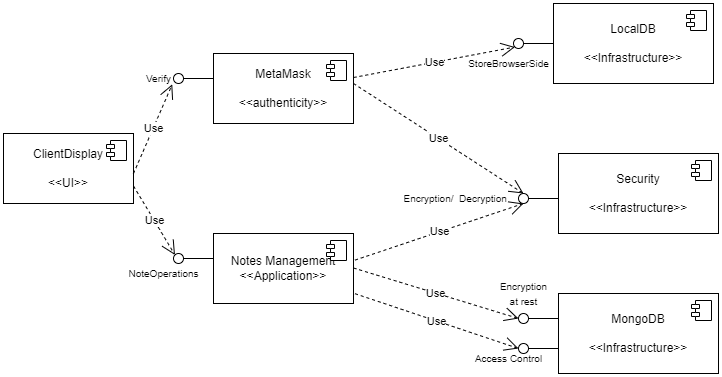
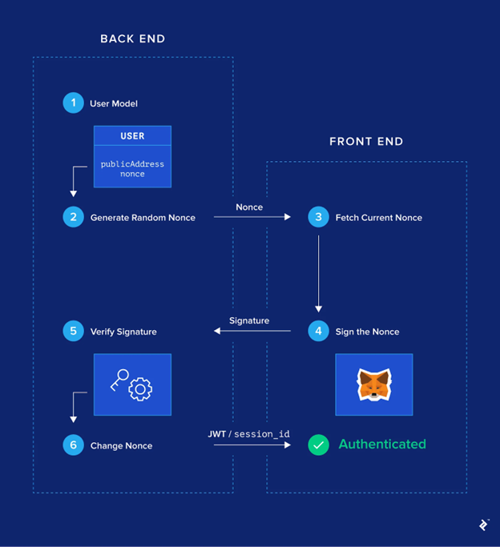

# **Architecture**

## Stakeholders:

### Internal

**Management:** These are the people who identified the need of such an app and outlined rough requirements that need to be satisfied for successful execution. This role was played by us.

**Developers:** These are the people who will create the app and design the front end as well. They will be responsible for aligning the product with the requirements. This role was played by us. 

**Course supervisor:** They will be responsible for making sure that the app works as intended. They are involved in the evaluation of the product based on privacy standards.

**Maintainers:** Once it is open sourced, they will be the ones to make changes to the repository as required for continued success of the app.

### External

#### Primary

**End-Users:** Individuals for whom this app is intended for. These are the people who we expect to use the app for creating and storing the notes.

#### Secondary

**Customer support:** These will be the individuals acting as first responders to the concerns which end-users may have.

**Regulatory bodies:** These are the individuals who have designed certain privacy practices and standards to which the app should conform for it to be widely compliant.

## Architectural Design Decisions:

### Major technologies and components:

#### UI

Frontend - responsible for displaying the notes in a user friendly manner.

**Implemented** using React.

#### Authentication and login

This is needed to establish the authenticity of the user so that only those notes are displayed which belong to the user. We do not want to use username and password as the login mechanism because the intention is not to collect no PII so that the system is never in a position to identify users at all.  \
**Implemented** using MetaMask.

#### Notes Management

This component covers creation, modification and deletion of the notes. It involves UI aspects as well. But mainly we refer to what is happening under the hood when we talk about notes management. For instance, how data is transferred when storage mode is toggled. 

Backend **implemented** using nodejs.

#### Storage

This component deals with where we are storing our notes. Based on the mode selected, the location used for storage will change.

If **server side** mode: MongoDB

If **local** mode: indexedDB

#### Encryption

This component covers the encryption aspects. It includes synthesis of the private key for encryption from the public address of metamask and encrypting the data on client side after notes are saved. The intention is to make sure that no unencrypted data leaves the client's machine.

**Implemented** using AES-GCM 256 bit

### Modes of communication

In this section, we will describe how the data flows in our system. When the note is being created for the very first time, data is only displayed on the client side and our app is not aware of it. Once the save button is clicked, the data is encrypted using AES-GCM 256 bit on the client machine. Depending on the storage mode, the data is moved:

1. Server side storage mode: Encrypted data is sent to be stored in MongoDB. The data in transit is protected using SSL/ TLS.
2. Local: the encrypted data stays on the machine itself so there is no communication with the server.

Now, if existing notes are modified, based on where they have been stored we will use the communication scheme accordingly. Lastly, if the storage mode is toggled then data will be moved server to local or local to server but the communication with server will always be using SSL/ TLS.

## **Architectural Models:**

### Key aspects for Security:

* Cryptographic verification of users through Metamask.
* Store JWT in HTTP-only cookie.
* AES-GCM encryption to store all notes.
* MongoDB Atlas uses its own encryption in transit and at rest (Enterprise).
* Private key for storage stored in IndexedDB with extractable property set to false, so no one can tamper with it. (Cannot be read by client side scripting in the browser)

**Architecture**

_Source: self drawn using draw.io_

**Use case diagram**

_Source: self drawn using draw.io_

**Component diagram**

_Source: self drawn using draw.io_

**MetaMask explanation**

_Source: https://www.toptal.com/ethereum/one-click-login-flows-a-metamask-tutorial_

### Important Scenarios:

-   **Event:** Creating a note

    **Triggers:** A new note is associated with the metamask public address and is then encrypted before being pushed to storage layers.

    **Interaction by external entity:** User clicks on add notes button in the web app. Adds some content to the note. User clicks on the save button.

    **Response from system:**

        1. Keep track of metamask public addresses.
        2. Display a new note in the UI.
        3. User adds the content in the note and saves it.
        4. Synthesize private encryption key using the public address of the metamask.
        5. Content of the note is encrypted using AES-GCM 256 bit.
        6. Depending on the storage toggle selected, data is sent to MongoDB or kept in local storage.

    **Relevance to privacy requirements:**

        1. We want the user to have the choice and control over the storage location.
        2. We do not want to store the encryption key on our end. This means that we cannot decrypt the notes (even if we want to) without the user’s involvement.
        3. We do not want unencrypted notes to leave the client’s machine.

-   **Event:** Editing a note (similar to the event: _creating a note_)

    **Triggers:** An existing note is opened and modified by the user. Then it is saved by clicking on the save button.

    **Interaction by external entity:** User clicks on an existing note in the web app. Adds/ removes some content from the note. User clicks on the save button.

    **Response from system:**

        1. Display existing notes in the UI associated with the user’s metamask address.
        2. User adds (or) removes the content from the note and saves it.
        3. Synthesize private encryption key using the public address of the metamask.
        4. Content of the note is encrypted using AES-GCM 256 bit.
        5. Depending on the storage toggle selected, data is sent to MongoDB or kept in local storage.

    **Relevance to privacy requirements:**

        6. We want the user to have the choice and control over the storage location.
        7. We do not want to store the encryption key on our end. This means that we cannot decrypt the notes (even if we want to) without the user’s involvement.
        8. We do not want unencrypted notes to leave the client’s machine.

**_Sequence diagram_**

_Source: self drawn using lucidchart_

