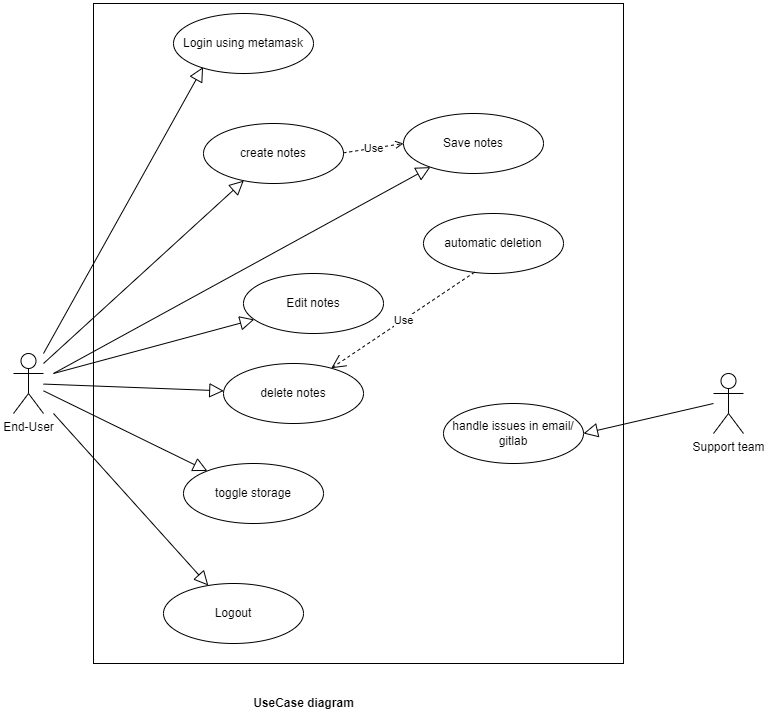
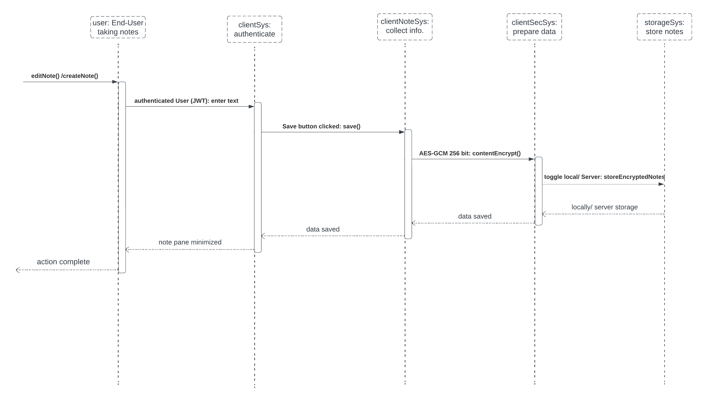
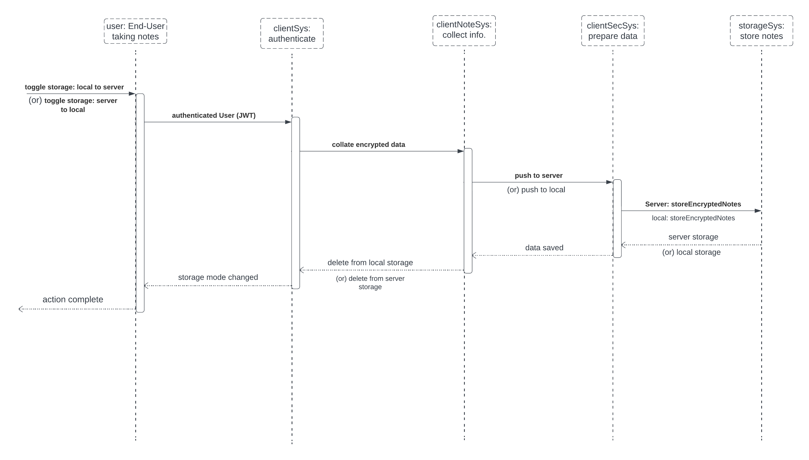

# **Architecture**

## Stakeholders [^SSA]:

### Internal

**Management:** These are the people who identified the need of such an app and outlined rough requirements that need to be satisfied for successful execution: This role was played by us.

**Developers:** These are the people who will create the app and design the front end as well. They will be responsible for aligning the product with the requirements: This role was played by us. 

**Course supervisor:** They will be responsible for making sure that the app works as intended. They are involved in the evaluation of the product based on privacy standards: Prof. Martin Robillard \& Jazlyn Hellman (TA)

**Maintainers:** Once it is open sourced, they will be the ones to make changes to the repository as required for continued success of the app: This will be done by us and the open source community following a pull request \& review mechanism.

### External [^TW]

#### Primary

**End-Users:** Individuals for whom this app is intended for. These are the people who we expect to use the app for creating and storing the notes.

#### Secondary

**Customer support:** These will be the individuals acting as first responders to the concerns which end-users may have.

**Regulatory bodies:** These are the individuals who have designed certain privacy practices and standards to which the app should conform for it to be widely compliant.

[^SSA]: Rozanski, N., & Woods, E. (2012). Software systems architecture : working with stakeholders using viewpoints and perspectives (2nd ed.). Addison-Wesley. Retrieved April 9, 2023, from INSERT-MISSING-URL.
[^TW]: Project stakeholders - who are they &amp; why are they important? (no date) Project Stakeholders - Who Are They &amp; Why Are They Important? Available at: https://www.teamwork.com/project-management-guide/project-stakeholders/ (Accessed: April 9, 2023). 

## Architectural Design Decisions:

### Major technologies and components:

#### UI

Frontend - responsible for displaying the notes in a user friendly manner.

**Implemented** using React.

#### Authentication and login

This is needed to establish the authenticity of the user so that only those notes are displayed which belong to the user. We do not want to use username and password as the login mechanism because the intention is not to collect no PII so that the system is never in a position to identify users at all. [^AL]  
**Implemented** using MetaMask. [^MM]

[^AL]:(2020) Understanding application authentication and authorization security. Available at: https://www.ibm.com/support/pages/understanding-application-authentication-and-authorization-security (Accessed: March 18, 2023). 
[^MM]:Dawson, J.E. (2021) Build a WEB3 DAPP in React &amp; Login with MetaMask, DEV Community. DEV Community. Available at: https://dev.to/jacobedawson/build-a-web3-dapp-in-react-login-with-metamask-4chp (Accessed: March 9, 2023). 

#### Notes Management

This component covers the full end-to-end implementation of various functionalities for the notes like creation, modification and deletion. It involves the UI aspects as well. But mainly we refer to what is happening under the hood when we talk about notes management. For instance, how data is transferred when storage mode is toggled. 

To fulfill these requirements in the most efficient way, we implemented our backend in NodeJs as it is a very robust framework. [^NJ]

[^NJ]:Arif, H. (2021) Build a simple notes app with Node.js and Mongoose, Medium. Better Programming. Available at: https://betterprogramming.pub/simple-notes-app-with-node-js-and-mongoosejs-6595cd5d15b (Accessed: February 21, 2023). 

#### Storage

This component deals with where we are storing our notes.  
Our app offers the following 2 modes of storage of the notes and based on the user's preference, the notes are stored in the respective locations, providing full access to the user:

If **server side** mode: MongoDB Atlas[^MA]

If **local** mode: IndexedDB [^IDB]

[^MA]:MongoDB Atlas documentation. Available at: https://www.mongodb.com/docs/atlas/
[^IDB]: Working with indexeddb (no date) web.dev. Available at: https://web.dev/indexeddb/#:~:text=IndexedDB%20is%20a%20low%2Dlevel,larger%20amounts%20of%20structured%20data. (Accessed: March 2, 2023). 

#### Encryption

Encryption is paramount to protecting user's privacy and protecting other services from tracking the user. It includes synthesis of the private key for encryption from the public MetaMask address of the user and encrypting the data on the client's side before the notes are saved in the user's preferred database. The intention is to make sure that no unencrypted data leaves the client's machine.

After researching on various cryptographic schemes we narrowed down to 2 cryptographic schemes which were relevant to our need of encrypting the notes, these were: XChaCha20-Poly1305[^XCP] & the AES-GCM 256 bit schemes[^AES].  

While developing encryption for our application we realized that the AES-GCM scheme is much more efficient as it allowed us to generate a private key for encryption using the user's address as the input string. This was not possible with XChaCha20-Poly1305 as it only allowed generation of keys using 32-bit strings and the user's public address is a 20-byte string.  

Hence we implemented encryption using **AES-GCM 256 bit**

[^AES]: AES256-GCM AES256-GCM - Libsodium documentation. Available at: https://libsodium.gitbook.io/doc/secret-key_cryptography/aead/aes-256-gcm. 
[^XCP]: XCHACHA20-Poly1305 Construction XChaCha20-Poly1305 construction - Libsodium documentation. Available at: https://libsodium.gitbook.io/doc/secret-key_cryptography/aead/chacha20-poly1305/xchacha20-poly1305_construction . 

### Modes of communication

In this section, we will describe how the data flows in our system. When the note is being created for the very first time, data is only displayed on the client side and our app is not aware of it. Once the save button is clicked, the data is encrypted using AES-GCM 256 bit on the client machine. Depending on the storage mode, the data is moved:

1. Server side storage mode: Encrypted data is sent to be stored in MongoDB. The data in transit is protected using SSL/ TLS.[^ST]
2. Local: the encrypted data stays on the machine itself so there is no communication with the server.

Now, if existing notes are modified, based on where they have been stored we will use the communication scheme accordingly. Lastly, if the storage mode is toggled then data will be moved server to local or local to server but the communication with server will always be using SSL/ TLS.

[^ST]: What is SSL, TLS and HTTPS? DigiCert. Available at: https://www.websecurity.digicert.com/en/ca/security-topics/what-is-ssl-tls-https.

### Decisions impacting privacy:

1. **Login functionality**[^LMM]: We did not want to collect any identifying information about the user while they were logging in. Further, we also did not want to compromise on functionality by making it complex for the user. We had to decide which mechanism we can use to achieve this objective. For instance, a random unique long string could be generated for each user. Subsequently, while logging in the user would need to provide that string. But this forces the user to store a hard to remember string which was not something we wanted to do. **We wanted to achieve the following:**
    1. _No linkage of user data with the identities of users._
    2. _Single click login_
    3. _Passwordless_
[^LMM]:Seal your document's integrity with MetaMask-powered eSignatures Revv. Available at: https://www.revv.so/sign-documents-with-metamask-wallet.html. 
2. **Client side encryption:**[^CSE] We had to decide at which point in the lifecycle of data do we introduce encryption to maximize not only security of data but also the privacy aspects for the user. Our goal was to design the app in such a way that in future even if the management or some external rules are introduced to reveal the content of user’s notes, it will not be simply possible to do so because of how the app was designed.
    1. _End to end security:_ We wanted to keep user’s PII secure right from before the notes are created to when they are deleted.
    2. For this we decided to keep client side encryption using AES-GCM 256 bit so that it only enters our system when it is encrypted. Across the whole lifecycle of user’s notes, we do not want to keep them in our system unencrypted. We also had to decide if and where we should store the private key used for encrypting notes. And if we do not store it, then how do we arrive at the exact same key corresponding to the note at decryption time on the client machine within the scope of browser storage.
   
[^CSE]: N. Surv, B. Wanve, R. Kamble, S. Patil and J. Katti, "Framework for client side AES encryption technique in cloud computing," 2015 IEEE International Advance Computing Conference (IACC), Banglore, India, 2015, pp. 525-528, doi: 10.1109/IADCC.2015.7154763.
3. **Storing data toggle:** We had to decide if we should have the option to allow the user to choose the storage location. We unanimously agreed that such an option should be there but much discussion ensued regarding till what point in the notes lifecycle this change should be allowed. For instance, whether the user should be allowed to move notes between storages after they have been created. We had to decide based on the following concerns:
    1. _Flexibility_ to the user to handle their data.
    2. _Access and control:_ Users should have access to their data storage location.
    3. _Choice:_ Ultimately, the system should adapt to what and when the user desires, not the other way round.

 
4. **No data mining:** This decision was straightforward as we did not want to mine user’s notes for personal information because this is one pain point found in many prominent note taking apps available in the market which we want to tackle through our app.
    1. _Data deletion policy:_ We had to decide how long we should retain the data.
    2.  _Privacy as a default setting:_ We had to decide which options should we introduce which makes the default behavior of our app more privacy oriented.

5. **Straightforward functionality:** This involved various design decisions to keep the app as simple as possible. We did not want to overburden the user with numerous complex functionalities in a note taking app.

6. **Web3 compatible and open source:**[^WTC] We had to decide if we should keep the app compatible with the emerging web3 paradigm. We found that using metamask can serve the dual purpose of ensuring that the app can have a single click login and also extends the functionalities to Web3/Blockchain use cases. Lastly, we want to keep the app's code open source under a license but it is contingent on obtaining permission from the course management.
[^WTC]: Solutions, W. (no date) Why is migrating web2 application to web3 good for your business? Available at: https://bestweb3development.com/product/migrate-web2-application-to-web3. 

7. **Respect for user’s privacy:**[^PRV] This involves taking decisions which will ensure that the app, unlike its competitors, is not intrusive by its nature. We wanted to keep it user-centric while making sure that privacy was not relegated to an afterthought.
        _No trackers:_ Our app does not track user activities on the web page.

[^PRV]:Web applications security and privacy | request PDF - researchgate. Available at: https://www.researchgate.net/publication/332463677_Web_applications_Security_and_Privacy. 
## **Architectural Models:**

### Key aspects for Security:

* Cryptographic verification of users through Metamask.
* Store JWT in HTTP-only cookie.
* AES-GCM encryption to store all notes.
* MongoDB Atlas uses its own encryption in transit and at rest (Enterprise).
* Private key for storage stored in IndexedDB with extractable property set to false, so no one can tamper with it. (Cannot be read by client side scripting in the browser)

**Architecture**

_Source: self drawn using draw.io_

**Use case diagram**

_Source: self drawn using draw.io_

**Component diagram**

_Source: self drawn using draw.io_

**MetaMask Flow Diagram**

_Source: [^MMM]

[^MMM]:Martiny, A. (2018) One-click login with blockchain: A Metamask Tutorial: Toptal®, Toptal Engineering Blog. Toptal. Available at: https://www.toptal.com/ethereum/one-click-login-flows-a-metamask-tutorial. 

### Important Scenarios:

-   **Event:** Creating a note

    **Triggers:** A new note is associated with the metamask public address and is then encrypted before being pushed to storage layers.

    **Interaction by external entity:** User clicks on add notes button in the web app. Adds some content to the note. User clicks on the save button.

    **Response from system:**

        1. Keep track of metamask public addresses.
        2. Display a new note in the UI.
        3. User adds the content in the note and saves it.
        4. Synthesize private encryption key using the public address of the metamask.
        5. Content of the note is encrypted using AES-GCM 256 bit.
        6. Depending on the storage toggle selected, data is sent to MongoDB or kept in local storage.

    **Relevance to privacy requirements:**

        1. We want the user to have the choice and control over the storage location.
        2. We do not want to store the encryption key on our end. This means that we cannot decrypt the notes (even if we want to) without the user’s involvement.
        3. We do not want unencrypted notes to leave the client’s machine.

-   **Event:** Editing a note (similar to the event: _creating a note_)

    **Triggers:** An existing note is opened and modified by the user. Then it is saved by clicking on the save button.

    **Interaction by external entity:** User clicks on an existing note in the web app. Adds/ removes some content from the note. User clicks on the save button.

    **Response from system:**

        1. Display existing notes in the UI associated with the user’s metamask address.
        2. User adds (or) removes the content from the note and saves it.
        3. Synthesize private encryption key using the public address of the metamask.
        4. Content of the note is encrypted using AES-GCM 256 bit.
        5. Depending on the storage toggle selected, data is sent to MongoDB or kept in local storage.

    **Relevance to privacy requirements:**

        6. We want the user to have the choice and control over the storage location.
        7. We do not want to store the encryption key on our end. This means that we cannot decrypt the notes (even if we want to) without the user’s involvement.
        8. We do not want unencrypted notes to leave the client’s machine.

**_Sequence diagram_**

_Source: self drawn using lucidchart_

3. **Event:** Toggle storage

    **Triggers:** Users may switch the storage location from server to local or vice versa.

    **Interaction by external entity:** User moves the toggle on the UI to switch to the desired mode.

    **Response from system:**

    _Depending on the current state, the response will be different._

      1. If no note has been created so far:
          1. Whichever mode user selects now will be the one used for all the notes subsequently created.
      2. If some notes have been created and then user switches the storage mode to a different one:
          1. Consider server to local storage
              - Determine the notes associated with the metamask public address of the user on the server.

                      (The notes will be encrypted strings.)

              - Notes will be downloaded to the client’s machine.
              - Once downloaded, the notes will be deleted from the server. This operation is atomic. The notes will not be left behind on the server once the client has opted for local storage. This is in line with data deletion policy for user privacy.
          2. Consider local storage to server
              - Encrypted notes will be uploaded to the server and deleted from the local storage. It is similar to the above point but in reverse.

                _(We do not yet possess the capability to keep some notes in the local storage and some other notes in the server side. It can be part of future enhancement of the project.)_

**Relevance to privacy requirements:**

      1. We want the user to have the choice and control over the storage location.
      2. We do not want unencrypted notes to leave the client’s machine.

**_Sequence diagram_**

_Source: self drawn using lucidchart_

**_Sequence diagram for logging in_**

_Source: self drawn using lucidchart_

## References
